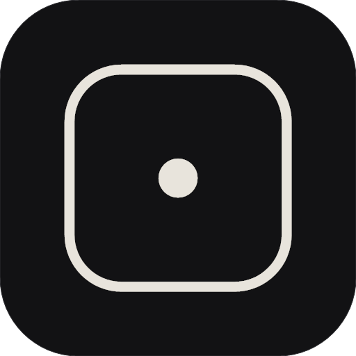

<p align="center">
  
</p>

<h1 align="center">DSH Desktop</h1>

<p align="center">
  Windows 上打开官方 <code>dsh web</code> 的窗口。<br>
  个人开发者 Zer0 · 非官方 · MIT
</p>

<p align="center">
  
  
  
</p>

---

> **⚠️ 重要声明**  
> 本项目是**非官方第三方开发**，与 DeepSeek 官方无关。  
> 官方 Harness：https://github.com/deepseek-ai/deepseek-harness  
> 本项目只是 Windows 上的打开壳，内核用的是官方 npm 包 `@deepseek-ai/dsh`。

---

DSH Desktop 是 Windows 上打开官方 `dsh web` 的一个窗口。个人开发者 Zer0 做的，里面跑的仍是 npm 上的官方包 [`@deepseek-ai/dsh`](https://www.npmjs.com/package/@deepseek-ai/dsh)。

官方 Harness 在 Windows 上主要是命令行：自己准备 Node、自己开终端、自己记端口；网页端攒下的会话、标题、外接模型也散落在 `~/.dsh` 里。这个窗口只补这一层——双击进官方界面，设置里可以跟着官方更新内核，也可以把本机网页端已经有的会话和外接模型合并进来。数据默认和命令行那份分开，免得两个入口互相踩；要共用同一份 `~/.dsh` 也可以。

和官方的不同就在这里：官方提供 Agent、插件和模型本身；我们提供打开、跟着更新、把本机用过的东西留下来。没有另做一套对话能力，也不包装成官方客户端。

官方项目：[deepseek-ai/deepseek-harness](https://github.com/deepseek-ai/deepseek-harness)

固定入口就是[本仓库](https://github.com/Zer0-stargazer/DSH-Desktop)。下载按版本走 [Releases](https://github.com/Zer0-stargazer/DSH-Desktop/releases)；介绍页在 [zer0-stargazer.github.io/DSH-Desktop](https://zer0-stargazer.github.io/DSH-Desktop/)。窗口版本记在 [CHANGELOG.md](./CHANGELOG.md)，和设置里的官方内核版本不是一回事。

---

## 它做什么

- 自带 Node，启动官方 `dsh web`，用独立窗口加载
- 默认数据在 `%APPDATA%\DSH Desktop\dsh-home`，和 `~/.dsh` 分开；设置里可选用同一份
- API Key 只存在本机，Windows DPAPI 加密
- 设置里同步网页端会话、标题、外接模型和缺的密钥（已有的不覆盖）
- 从 npm 同步官方内核，带进度、代理（系统代理 / Clash `127.0.0.1:7897`）、回滚到自带版本
- 诊断报告脱敏后可导出

Agent、插件、模型本身仍走 [官方 Discussions](https://github.com/deepseek-ai/deepseek-harness/discussions)。

## 它不做什么

不改官方内核，不嵌入其它编码助手，不代理你的 Key，不提供官方支持。

## 运行

**现成包**（给使用者）：从 [Releases](../../releases) 下载解压，运行 `DSH Desktop.exe`。第一次填自己的 DeepSeek API Key。程序未签名，Windows 可能提示未知发布者。

点右上角关闭会进托盘。退出：托盘右键「退出」。

**从源码**（给开发者）：

```powershell
npm install
# 可选：放入与 npm 同主版本的便携 Node，打包时会打进 extraResources
# 见 vendor/README.md
npm start
```

```powershell
npm run dist:dir    # dist/win-unpacked/
```

打包需要便携 Node（`vendor/node/node.exe` + 自带 npm）。`asar` 必须为 false：官方内核要真实文件系统。不要让 electron-builder 按 Electron ABI 重编原生模块。

## 数据

| | 路径 |
| --- | --- |
| 默认 DSH_HOME | `%APPDATA%\DSH Desktop\dsh-home` |
| 可选共用 | `%USERPROFILE%\.dsh` |
| 壳配置 / 加密 Key | `%APPDATA%\DSH Desktop\config.json` |

共用后两边不要同时开。

## 问题与建议

窗口本身（启动、标题栏、同步、内核更新进度、打包）请开 Issue：  
https://github.com/Zer0-stargazer/DSH-Desktop/issues/new/choose

提交前到设置 → 诊断 → 导出报告，不要附 API Key。内核 / Agent / 插件去 [官方 Discussions](https://github.com/deepseek-ai/deepseek-harness/discussions)。不会用 GitHub 的，把报告发 gl20070126@gmail.com。

## 内核更新（已知会很慢）

从 npm 拉官方内核，依赖量大，常要数分钟到十余分钟。进度到 90% 附近往往还在下载，条子偶尔会停一下或数字跳一下，只要窗口还在、最后能完成，一般不是崩溃。首次打开、以及刚更新后的第一次启动也会明显偏慢。建议网络稳定、代理开着时再点「同步官方更新」。

## 测试

```powershell
npm run test:about
npm run test:ipc
npm run test:sync      # 读本机 ~/.dsh，写到临时目录，不改你的桌面端数据
```

## 声明

个人开发者 Zer0。与 DeepSeek 公司无隶属、无授权。内核行为以官方为准。详见应用内「关于」，以及 [SECURITY.md](./SECURITY.md)。

## License

[MIT](./LICENSE)。官方 `dsh`、Electron / Chromium 各有其许可证。
